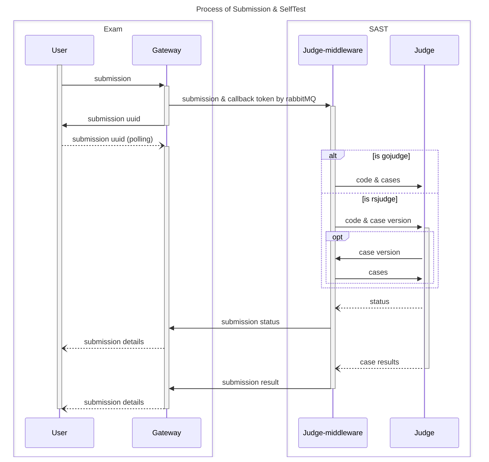

# 处理提交和自测

提交和自测是 SASTOJ 中最重要的部分之一。

## 提交流程

我们的提交和自测的流程是一个很有意思的设计，涉及消息队列、负载均衡、API 回调、缓存与持久化等等。

当网关或者 `user/contest` 接收到提交请求后，会生成一个临时的 `UUID`，作为这个提交的标识符。这个 `UUID` 会进入缓存，但是不会存入数据库。当评测中间价从**消息队列**中获得到提交后，会将其存入数据库，并在 Redis 中存入 `UUID -> submission`。注意，这个时候 `submission` 已经获取到了 `submission_id`。此外，`callback` 函数中，也需要用到 UUID 作为标识符。

## Redis 存储

Key: `submission:{userID}:{UUID}`

Value: `{submission}`

## Status

SASTOJ 的评测状态有以下几种：

|序号|含义|
|---|---|
|0|无效|
|1|通过|
|2|编译错误|
|3|答案错误|
|4|格式错误|
|5|运行错误|
|6|时间超限|
|7|内存超限|
|8|输出超限|
|9|等待中|

当评测中间件收到提交后，会将状态设置为 `9`，表示等待中。当评测完成后，会将状态设置为对应的状态。
