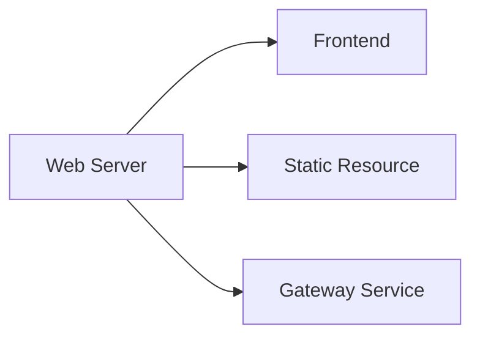

# 网关开发

网关是 SASTOJ 应对学校网络问题最主要的手段，它通过横向扩容减小主服务器的网络压力，同时可以优化考场考生的体验。为了方便在考场机房（Windows 7）部署，我们需要尽可能减小网关中的服务数量，同时降低对平台的要求。目前 Gateway 包括 Gateway Service, Frontend, Static Resource, Web Server 四个部分。

## 网关服务

网关服务是内部是 `user/gateway` 服务，它是 `user/contest` 的同 API 实现，这么实现可以让前端在开发的时候可以通过同一的 API 请求到一样的资源，无论是否有部署 Gateway 服务。同时也让我们的资源有了内部纵向分发的能力。
