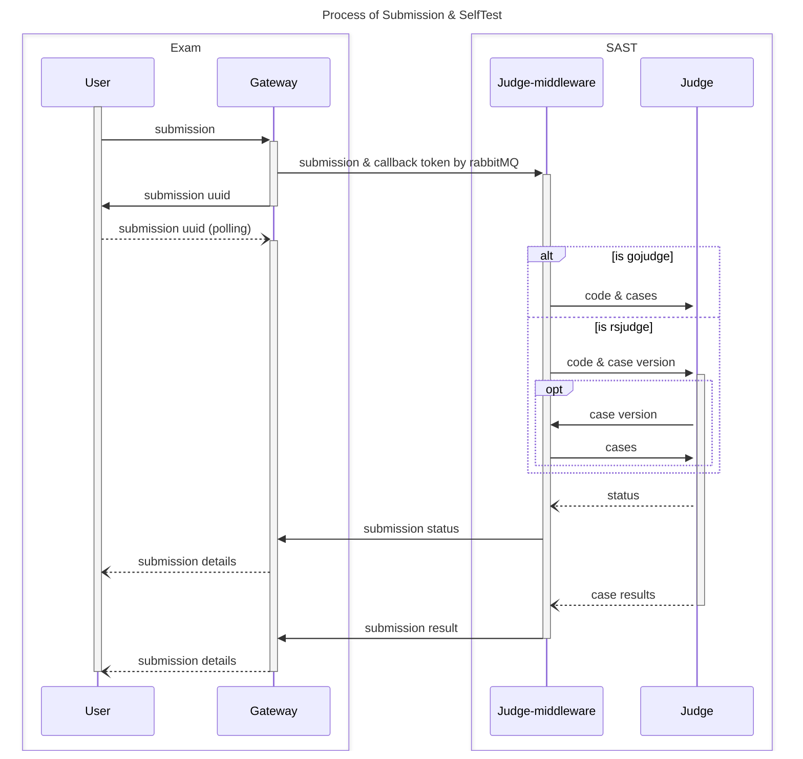

# 提交和自测

提交和自测是 SASTOJ 中最重要的部分之一。

## 提交流程

我们的提交和自测的流程是一个很有意思的设计，涉及消息队列、负载均衡、API 回调、缓存与持久化等等。

当网关或者 `user/contest` 接收到提交请求后，会生成一个临时的 `UUID`，作为这个提交的标识符。这个 `UUID` 会进入缓存，但是不会存入数据库。当评测中间价从**消息队列**中获得到提交后，会将其存入数据库，并在 Redis 中存入 `UUID -> submission`。注意，这个时候 `submission` 已经获取到了 `submission_id`。此外，`callback` 函数中，也需要用到 UUID 作为标识符。

## 评测状态

SASTOJ 的评测状态有以下几种：

|序号|含义|Key|
|---|---|---|
|0|无效|Invalid|
|1|通过|Accepted|
|2|编译错误|Compile Error|
|3|答案错误|Wrong Answer|
|4|格式错误|Presentation Error|
|5|运行错误|Runtime Error|
|6|时间超限|Time Limit Exceeded|
|7|内存超限|Memeory Limit Exceeded|
|8|输出超限|Output Limit Exceeded|
|9|等待中|Waiting|
|10|评测中|Judging|
|11|系统错误|System Error|
|12|不通过|Unaccepted|

当评测提交后，状态将被设置为 `Waiting`，评测中间件收到提交后，会将状态设置为 `Judging`，表示评测中。当评测完成后，会将测试点的状态设置为对应的状态，然后根据测试点的状态，计算出提交的状态。对于所有非 `Accepted` 的状态，提交的状态将被设置为 `Unaccepted`。

## 持久化

在数据库中，评测结束后，需要将评测结果存入 `submissions` 表中，需要存入的字段有：

- `problem_id`：外键，指向 `problems` 表
- `user_id`：外键，指向 `users` 表
- `code`：用户提交的代码（或者用户提交的内容）
- [`status`](#评测状态)：评测状态
- `point`：本次评测的得分
- `create_time`：提交时间，从消息队列中获取
- `total_time`：总耗时
- `max_memory`：最大内存
- `language`：使用的语言
- `case_version`：本次评测使用的测试点版本，从 `problems` 表中获取，用于判断测试点是否更新
- `stderr`：编译错误或者运行错误的信息

对于子任务(subtasks)的评测结果，需要存入 `submission_subtasks` 表中，需要存入的字段有：

- `submission_id`：外键，指向 `submissions` 表
- `state`：测试点的状态，同上
- `total_time`：总耗时
- `max_memory`：最大内存
- `point`：本次子任务的得分

对于测试点的结果，需要存入 `submission_cases` 表中，需要存入的字段有：

- `submission_id`：外键，指向 `submissions` 表
- `problem_case_id`：外键，指向 `problem_cases` 表
- `state`：测试点的状态，同上
- `time`：耗时
- `memory`：内存使用
- `message`：评测机返回的需要持久化的信息，通常为编译报错
- `point`：本测试点的得分

## Redis 存储

我们会将提交存入 Redis，以便于 `user` 端可以通过 `UUID` 获取到提交结果。

Key: `submission:{userID}:{UUID}`

Value: `{submission}`

其中 `submission` 是 `pkg/mq` 中定义的 `Submission` 结构体。当然，这个结构体会被序列化为 JSON 字符串，所以开发者也可以定义自己的结构体，只需要能够兼容原结构体即可，当然，直接使用原结构体会是更好的选择。

## 更新回调

如果评测的 `Token` 字段不为空，评测机需要将评测结果回调给调用方。回调的 `Endpoint` 需要从 `Redis` 中获取，`Key` 为 `gateway:{UUID}`。再分别通过调用 `UpdateSubmission` 或 `UpdateSelfTest` 接口，将评测结果回调给调用方。
