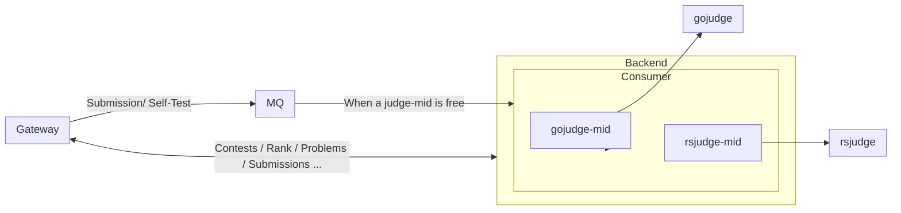

# 简介

这个项目最大的意义在于“不触发学校网关警报的前提下，完成程序设计竞赛的任务”，从某种意义上说，是已经凉了大半截的 NOJ 的替代品。推测可能是流量过大触发了学校网关警报，目前的解决方案是减少发包次数和包的体积，从结果角度出发，与抗DDOS的解决方案有异曲同工之处。

## 基础需求

- 高并发下不被学校网关识别为DDOS攻击 (可能) 导致比赛中断
- 保证比赛过程中服务的稳定性，不能出现考试过程中服务重启的情况
- 满足IOI赛制
- 与 `go-judge` 通讯完成判题
- 能够查看比赛排行

## 基础功能 (Basic OJ)

- [x] 用户管理和题库管理
- [x] 查看题面和比赛
- [x] 在线运行代码和提交代码（使用http与sandbox通讯）
- [x] 查看分数和运行结果

## 高级功能 (SASTOJ)

- [x] 使用grpc与sandbox通讯
- [x] 对接口限流
- [x] 使用消息队列优化判题请求

- [x] 适配IOI赛制
- [x] 实时排行榜
- [ ] 系统监控
- [ ] 交互/special judge

## 架构设计

### 独立 CDN

使用CDN将题面和静态文件从大活服务器分离，减少从大活离开的、重复的大包

### 分布式网关

将大量访问的GET请求从原服务抽离（如：Rank, Contest），减少大活的吞吐

## 参考资料

**NOJ (PHP)**

- <https://noj.njupt.edu.cn/>
- <https://github.com/ZsgsDesign/NOJ>

**Hydro (NodeJS)**

- <https://github.com/hydro-dev/Hydro>

**QDUOJ (Python)**

- <https://github.com/QingdaoU/OnlineJudge>

**UOJ (PHP+CPP)**

- <https://github.com/UniversalOJ/UOJ-System>

**CSGOJ**

- <https://github.com/CSGrandeur/CSGOJ>
