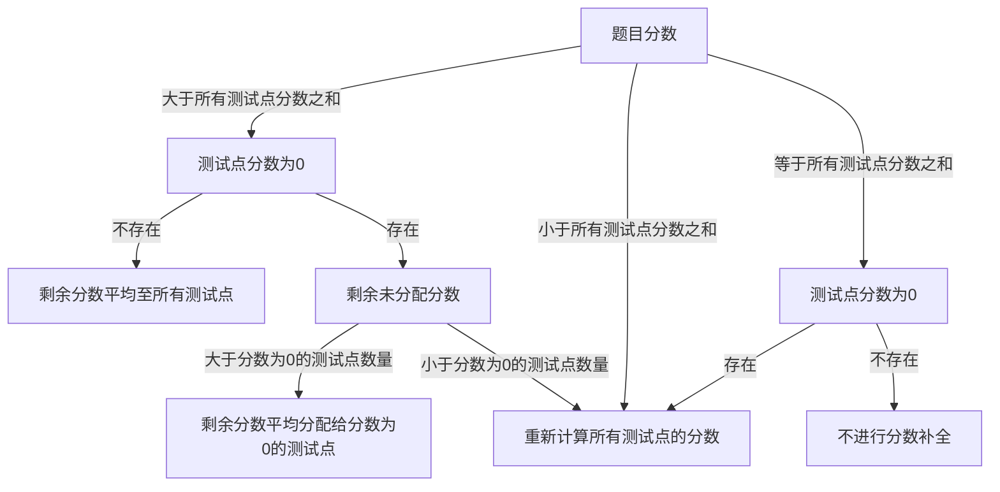

# 配置文件

配置文件指题库或比赛中每一道题目的独立配置文件，包含了题目评测所需的所有信息，如时间限制、内存限制、输入输出文件等。配置文件的格式采取`toml`格式，标准采用[`rsjudge-schema`](https://github.com/Jisu-Woniu/rsjudge-test-cases-schema)，部分字段仍在完善中。

在sastoj上传题目时，配置文件的命名应为 `config.toml`，并放置在题目的根目录下。

以下是一份传统题、简易任务类型的配置文件示例：
```toml
# 题目总分
score = 100

[judge]
# 评测类型
judgeType = "classic"

[resourceLimits]
# 时间限制
time = 1000
# 内存限制
memory = 256

[task]
# 评测任务类型
taskType = "simple"

[[task.cases]]
# 测试点1 输入用例文件文件名
input = "1.in"
# 测试点2 标准答案文件文件名
answer = "1.ans"

[[task.cases]]
# 测试点2 输入用例文件文件名
input = "2.in"
# 测试点2 标准答案文件文件名
answer = "2.ans"
# 测试点2 分数 可选项
score = 60
```
字段含义将在下文进行解释。

## 评测类型 (`judgeType`)

评测类型指题目的评测方式，目前支持的评测类型包含传统题 (`classic`)、交互题 (`interactive`)、特殊评测题(`special-judge`)。

### 传统题 (`classic`)

传统题指的是在本地使用沙箱进行评测、在限定的时间和内存限制内、将输入用例 (.in文件) 作为标准输入，将选手程序标准输出与标准答案 (.ans或.out文件) 进行比对的评测方式。

一道传统题目要求包含一个或多个测试点，每个测试点包含一个输入用例文件和一个标准答案文件，和该测试点的分数 (可选)。只有当选手程序的输出与标准答案一致时，该测试点的状态为 `Accepted`，该测试点才会作为通过并计入分数。

传统题包含两种任务类型 (`taskType`)，分别为简易任务和子任务。

#### 简易任务 (`simple`)

简易任务表示使用测试点 (`case`) 作为评测单元，整题分数为所有测试点分数之和，由于每个测试点最小分数为1分，因此题目总分不可小于测试点数量。

传统题目的建议任务评测配置文件示例已在上文给出。

#### 子任务 (`subtasks`)

在子任务评测题中，每道题目可包含多个子任务 (`subtasks`)，每个子任务可包含多个测试点 (`case`) 和该子任务的分数 (可选)。只有当该子任务下所有测试点都为通过时，才可以得到该子任务的分数，整题的分数为所有子任务分数之和。因此，在子任务中，子任务所属的测试点中的分数字段不起作用。

以下为子任务评测题的配置文件示例：
```toml
score = 100

[judge]
judgeType = "classic"

[resourceLimits]
time = 1000
memory = 256

[task]
# 子任务评测类型
taskType = "subtask"

[[task.subtasks]]
# 子任务1 分数为40
score = 40

[[task.subtasks.cases]]
# 子任务1 测试点1 输入用例文件文件名
input = "1.in"
# 子任务1 测试点1 标准答案文件文件名
answer = "1.ans"

[[task.subtasks.cases]]
# 子任务1 测试点2 输入用例文件文件名
input = "2.in"
# 子任务1 测试点2 标准答案文件文件名
answer = "2.ans"

[[task.subtasks]]
# 子任务2 分数为60
score = 60

[[task.subtasks.cases]]
# 子任务2 测试点1 输入用例文件文件名
input = "3.in"
# 子任务2 测试点1 标准答案文件文件名
answer = "3.ans"

[[task.subtasks.cases]]
# 子任务2 测试点2 输入用例文件文件名
input = "4.in"
# 子任务2 测试点2 标准答案文件文件名
answer = "4.ans"
```

### 交互题 (`interactive`)

交互题目前还不被sastoj支持，下文仅用于解释交互题的配置文件。

交互题往往指的是IO交互，在选手程序和评测程序之间进行交互，将选手程序的标准输出作为评测程序的标准输入，评测程序的标准输出作为选手程序的标准输入，直至评测结束，题目结果将由评测程序给出。在交互题中，需要额外给出一个评测程序。

交互题的配置文件示例：
```toml
score = 100

[judge]
# 评测类型
judgeType = "interactive"
# 评测程序
interactor = "interactor.cpp"

[resourceLimits]
time = 1000
memory = 256

[task]
taskType = "simple"

[[task.cases]]
input = "1.in"
answer = "1.ans"

[[task.cases]]
input = "2.in"
answer = "2.ans"
score = 60
```

### 特殊评测题 (`special-judge`)

特殊评测题目前还不被sastoj支持，下文仅用于解释特殊评测题的配置文件。

特殊评测题指的是在评测过程中，需要使用特殊的评测程序对选手程序的输出进行评测，而不是简单的比对标准答案，通常也被称为自定义校验题。在特殊评测题中，也需要额外给出一个评测程序。特殊评测题往往需要 `testlib` 等评测库的支持。

以下是一个使用特殊评测、使用子任务进行评测的特殊评测提配置文件示例
```toml
score = 100

[judge]
# 评测类型
judgeType = "special-judge"
# 自定义校验器/评测程序
checker = "checker.cpp"

[resourceLimits]
time = 1000
memory = 256

[task]
taskType = "subtask"

[[task.subtasks]]
score = 40

[[task.subtasks.cases]]
input = "1.in"
answer = "1.ans"

[[task.subtasks.cases]]
input = "2.in"
answer = "2.ans"

[[task.subtasks]]
score = 60

[[task.subtasks.cases]]
input = "3.in"
answer = "3.ans"

[[task.subtasks.cases]]
input = "4.in"
answer = "4.ans"
```

## 资源限制 (`resourceLimits`)

资源限制指题目评测所需的时间限制和内存限制，时间限制单位为毫秒，内存限制单位为 `MB`。

### 时间限制 (`time`)

时间限制指选手程序在评测机上运行的最长时间，超过时间限制的程序将被强制终止，评测结果为 `Time Limit Exceeded`。一般情况下，选手程序计时采用的是 CPU Time，以保证在系统不同负载下的一致性。如选手程序使用了多线程，则选手程序运行时间为所有线程的总运行时间。

在评测时，一般会同时限制程序的真实时间，以防止选手程序使用 `sleep` 等系统调用来规避时间限制。超出真实时间限制的程序的评测结果也为 `Time Limit Exceeded`。

以 [`go-judge`](https://github.com/criyle/go-judge) 为例，评测机的默认时间限制检查周期为 100ms，即每隔 100ms 检查一次程序是否超时，所以一般情况下，超时的时间会比设定的时间限制多出小于100ms的运行时间。

### 内存限制 (`memory`)

内存限制指选手程序在评测机上运行的最大峰值内存使用量，超过内存限制的程序将被强制终止，评测结果为 `Memory Limit Exceeded`。

以 [`go-judge`](https://github.com/criyle/go-judge) 为例，内存检查间隔和时间限制检查周期相同，即每隔 100ms 检查一次程序的内存使用量。

目前绝大多数在线评测平台的内存检查都是基于 `cgroup v2` 进行的，但在较低版本的Linux系统上或部分评测平台仍在使用 `maxrss` 进行，这种内存检查方式会造成内存使用量不准确，尤其是在选手程序内存占用较小时，在大部分题目中一般不会有问题，在部分卡常数据下可能会出现误判。

## 赛制

下文介绍的为不同赛制对评测的区别，而不是赛制的排名方法。

在不同比赛赛制中，往往对评测的要求有所不同，下文将介绍不同赛制对评测的要求。

### OI赛制

OI赛制常见于中小学生的 CSP-J/S 和 NOIP 竞赛、蓝桥杯和部分课程测验中，特点是在比赛结束前，选手可以多次保存或提交程序，但是每次提交后不会进行评测，选手也无法获得评测结果。在比赛结束后，系统会对选手最后一次提交的程序进行评测，选手的成绩以最后一次提交的程序为准。

在评测时，OI赛制下的题目会评测所有的测试点，选手的得分为所有测试点的得分之和。

在部分 OI赛制的比赛中，选手无法在和评测机相同的环境下测验程序，因此需要格外注意代码在不同系统、不同编译器下的答案是否正确。

### IOI赛制

IOI赛制为IOI竞赛、天梯赛等竞赛所用的赛制，特点是选手在比赛中可多次提交程序，每次提交后会进行评测，选手可以实时获得评测结果。每道题目的最终得分为所有提交中的最高分数。

在评测时，IOI赛制下的题目会评测所有的测试点，选手的得分为所有测试点的得分之和。

### ICPC赛制

ICPC赛制为ACM-ICPC竞赛所用的赛制，特点是选手在比赛中可多次提交程序，每次提交后会进行评测，选手可以实时获得评测结果。

在评测时，ICPC赛制下的题目会逐一评测测试点，当一个测试点未能通过 (`Unaccepted`) 时，该测试点后的测试点将不再评测，该题的得分为 0。只有当选手程序通过所有测试点时，才可以获得该题分数。

## 分数补全

由于测试点和子任务的分数为可选项，因此会在题目上传时，补全所有所需的分数。下文以传统题目、简易任务为例，介绍分数补全的方法。

对于一个传统题目、简易任务的题目配置文件，应当满足：

- 题目总分**不为**负数，且**高于**测试点数量，即每一个测试点的最低分数为 1 分。
- 测试点数量**不**为0

则会使用以下规则进行分数补全和检查：

1. 如果题目分数**等于**所有测试点分数之和，且**不存在**测试点分数为0，则不进行分数补全。
2. 如果题目分数**等于**所有测试点分数之和，但**存在**测试点分数为0，则重新计算所有测试点的分数。
3. 如果题目分数**小于**所有测试点分数之和，则重新计算所有测试点的分数。
4. 如果题目分数**大于**所有测试点分数之和，且**存在**测试点分数为0，且剩余未分配分数**大于**分数为0的测试点数量，则将剩余分数平均分配给分数为0的测试点。
5. 如果题目分数**大于**所有测试点分数之和，且**存在**测试点分数为0，且剩余未分配分数**小于**分数为0的测试点数量，则重新计算所有测试点的分数。
6. 如果题目分数**大于**所有测试点分数之和，且**不存在**测试点分数为0，则将剩余分数平均至所有测试点。



### 分数分配方式

分数分配时，应当尽可能地让所有测试点的分数尽可能平均，即各个测试点中分数差距尽可能小，因此分数分配方式为：当前待分配分数 = 剩余分数 / 剩余测试点数量，向下取整。

## 转换工具

为了方便地从[`hydro`](https://github.com/hydro-dev/Hydro)迁移，我们提供了转换工具，同时支持从测试用例生成配置文件。

### yapyto

- [https://github.com/FishZe/yapyto](https://github.com/FishZe/yapyto)

### yacppto (开发中)

- [https://github.com/Serein207/yacppto](https://github.com/Serein207/yacppto)

### yarust (暂不支持)

- [https://github.com/NJUPT-SAST/yarusto](https://github.com/NJUPT-SAST/yarusto)